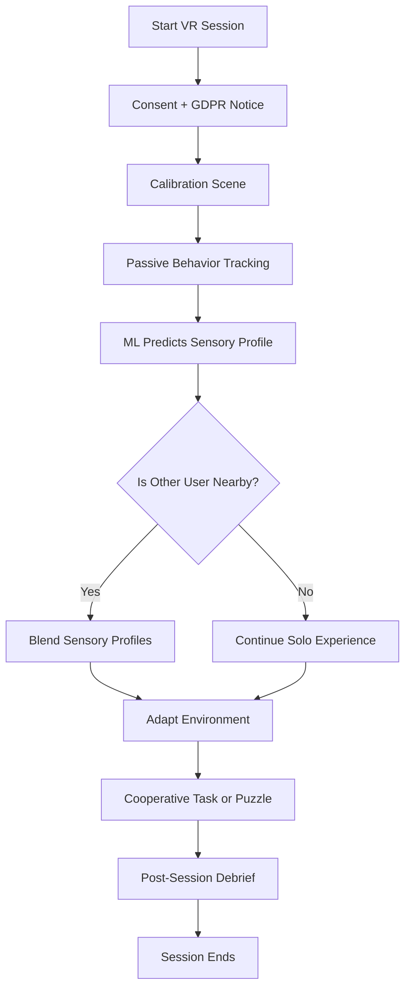

# Neuroverse: Adaptive VR for Neurodivergent Empathy

> 🌍 A VR platform that adapts to individual sensory needs — connecting neurodivergent and neurotypical users through shared, empathetic interaction.

This project explores adaptive sensory filtering and profile blending in shared VR experiences between neurotypical and neurodivergent individuals. Built in Unity using C# and deployed on Meta Quest.

## 🧠 Features

- Sensory calibration and profile prediction using ML
- Real-time filtering (audio, visual, motion)
- Shared user blending engine
- GDPR-compliant anonymous data collection
- Modular Unity-based architecture

➡️ **[See Full Development Guide on GitHub Wiki](https://github.com/Ziforge/Neuroverse/wiki/Development-Setup-Guide)**

## 🔁 Flow Chart

## 📂 Structure

- `docs/`: Academic LaTeX report and diagrams  
- `unity_project/`: Unity C# source files  
- `data/`: Anonymized datasets  
- `website/`: HTML files for recruitment and consent  

## 🧪 Run the Study

1. Clone the repo  
2. Open `unity_project/` in Unity 2022+  
3. Load the calibration or experience scenes  
4. Start testing on Meta Quest 3  

## 🔧 CI Test Settings

To enable continuous integration (CI) for your Unity project, follow these steps:

1. Ensure you have a Unity license set up in your repository secrets.
2. The CI workflow is defined in the `.github/workflows/ci.yml` file.
3. The workflow will run on every push and pull request to the `main` branch.
4. The workflow includes steps to:
   - Checkout the repository
   - Set up .NET and Unity
   - Activate the Unity license
   - Run Unity tests
   - Publish test results

## 📜 License

Licensed under GPL-3.0 or MIT

## 👥 Contributing

See [Contributing Guide on the Wiki](https://github.com/Ziforge/Neuroverse/wiki/Contributing-to-Neuroverse)
