# Neuroverse: Adaptive VR for Neurodivergent Empathy

---

> 🌍 A VR platform that adapts to individual sensory needs — connecting neurodivergent and neurotypical users through shared, empathetic interaction.

This project explores adaptive sensory filtering and profile blending in shared VR experiences between neurotypical and neurodivergent individuals. Built in Unity using C# and deployed on Meta Quest 3.

## 🧠 Features

```mermaid
flowchart TD
    A[Raise Wrist 🧠] --> B{Input Type?}

    B -- "Hand Tracking ✋" --> C[Tap Wrist to Open UI 👆]
    B -- "Controller 🎮" --> D[Press Menu Button 🎮]
    B -- "Gesture 🫰" --> E[Wrist Pinch Activation ✋]
    

    C --> F[Show Sensory Menu Panel 📺]
    D --> F
    E --> F

    F --> G{Choose Tab}
    G --> G1[Sensory Filters 🔆]
    G --> G2[Presets 🎮]
    G --> G3[Profile 🧑‍🦱]
    G --> G4[Environment 🌍]

    G1 --> H1[Adjust Sliders:\nVisual, Audio, Haptics, Motion]
    G2 --> H2[Select Mode:\nCalm / Stim / Focus]
    G3 --> H3[Save or Load Profile]
    G4 --> H4[Adjust Lighting, Space, Background]

    H1 --> I[Save Settings ✅]
    H2 --> I
    H3 --> I
    H4 --> I

    I --> J[Return to VR World 🧘]

    %% Improved styling for accessibility
    style F fill:#ffffff,stroke:#333,stroke-width:2px
    style G1 fill:#ddeeff,stroke:#000,stroke-width:1px
    style G2 fill:#ddeeff,stroke:#000,stroke-width:1px
    style G3 fill:#ddeeff,stroke:#000,stroke-width:1px
    style G4 fill:#ddeeff,stroke:#000,stroke-width:1px
```

```mermaid
flowchart TD
    A[🏁 Start VR Session] --> B{Calm Mode Active?}

    B -- Yes --> C[🧘 Stationary or Room-Scale Only]
    B -- No --> D{User Movement Preference?}

    D -- "Teleportation 🔄" --> E[Point & Click to Move]
    D -- "Smooth Locomotion 🎮" --> F[Joystick Movement]

    F --> F1[🎚️ Speed Slider:\nDrift / Natural / Snappy]
    F --> F2[🎚️ Turn Rate Slider:\nSlow / Medium / Fast]

    D -- "Dash (Short Burst) ⚡" --> G[Click to Dash]

    D -- "Waypoint Auto-Move 🎯" --> H[Select Path > Auto Glide]

    E --> I[🛑 Motion Lock Option Available]
    F2 --> I
    G --> I
    H --> I

    I --> J[✅ Save Movement Profile]
    J --> K[🌍 Begin Experience]

    style A fill:#ffffff,stroke:#222222,stroke-width:1.5px
    style B fill:#eeeeee,stroke:#444444,stroke-width:1.5px
    style D fill:#dddddd,stroke:#444444,stroke-width:1.5px
    style E fill:#d0eaff,stroke:#000000,stroke-width:1.5px
    style F fill:#d0eaff,stroke:#000000,stroke-width:1.5px
    style G fill:#d0eaff,stroke:#000000,stroke-width:1.5px
    style H fill:#d0eaff,stroke:#000000,stroke-width:1.5px
    style I fill:#f9f9f9,stroke:#333333,stroke-width:1.5px
    style J fill:#c8f0c8,stroke:#000000,stroke-width:1.5px
    style K fill:#b2f0e0,stroke:#000000,stroke-width:1.5px
```

    
- Sensory calibration and profile prediction using ML
- Real-time filtering (audio, visual, motion)
- Shared user blending engine
- GDPR-compliant anonymous data collection
- Modular Unity-based architecture

➡️ **[See Full Development Guide on GitHub Wiki](https://github.com/Ziforge/Neuroverse/wiki/Development-Setup-Guide)**

## 🔁 Flow Chart

## 📂 Structure

- `docs/`: Academic LaTeX report and diagrams  
- `unity_project/`: Unity C# source files  
- `data/`: Anonymized datasets  
- `website/`: HTML files for recruitment and consent  

## 🧪 Run the Study

1. Clone the repo  
2. Open `unity_project/` in Unity 2022+  
3. Load the calibration or experience scenes  
4. Start testing on Meta Quest 3  

## 📜 License

Licensed under GPL-3.0 or MIT

## 👥 Contributing

See [Contributing Guide on the Wiki](https://github.com/Ziforge/Neuroverse/wiki/Contributing‐to‐Neuroverse)
